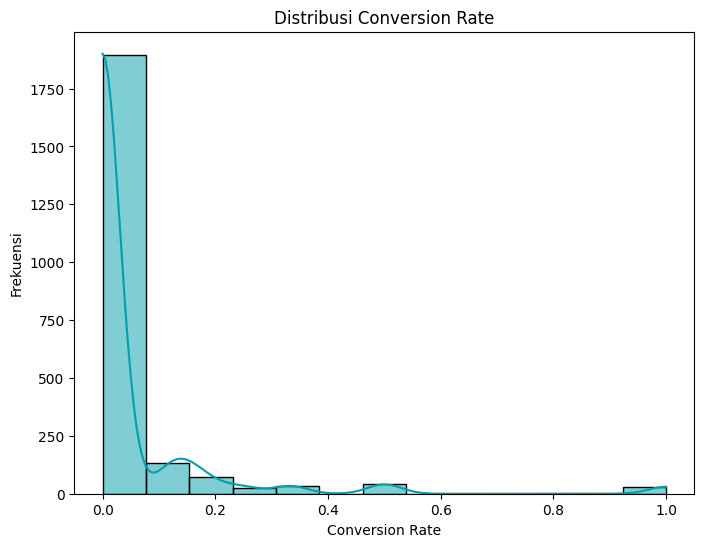
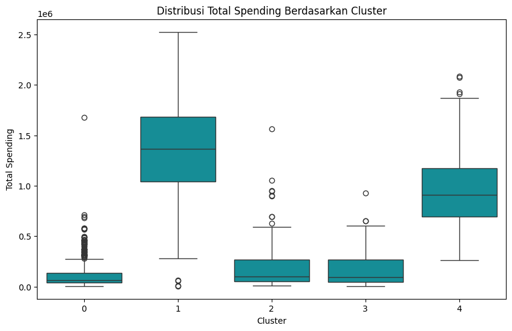

# Customer Personality Prediction
Predict Customer Personality to Boost Marketing Campaign by Using Machine Learning.

## Project Overview
In this project, I will work as a Data Scientist in a company as the core Data Science Team. I am given the responsibility to process historical marketing campaign data to improve performance and target the right customers to transact on the company's platform. Here I will learn how to process data, clean data, create machine learning models, and draw conclusions and business insights that can be recommended regarding the current marketing campaign.

## Table of Contents
1. [Business Problem](#business-problem)
2. [Objective](#objective)
3. [Data](#data)
4. [Feature Engineering](#feature-engineering)
5. [Exploratory Data Analysis (EDA)](#exploration-data-analysis-eda)
6. [Data Cleaning & Preprocessing](#data-cleaning--preprocessing)
7. [Machine Learning Modeling](#machine-learning-modeling)
8. [Customer Personality Analysis for Marketing Retargeting](#customer-personality-analysis-for-marketing-retargeting)
9. [Business Recommendations](#business-recommendations)

## Business Problem
The company wants to improve the performance of marketing campaigns by targeting customers more precisely based on their personalities. Currently, companies struggle to understand customer behavior and personality, which leads to less than optimal ad targeting. As a consequence, marketing campaigns are less effective, with low conversion rates.

## Objective
The purpose of this project is to build a machine learning model that is able to predict customer personality based on historical marketing campaign data, and provide strategy recommendations that can help improve targeting and marketing campaign performance.

## Data
[The dataset](data/marketing_campaign_data.csv) used in this project contains historical marketing campaign data from the company's customers, including information about demographics, interaction history with marketing campaigns, and purchase behavior. The dataset can be accessed in the data folder. 

Some of the attributes in this dataset are : Unnamed: 0, ID, Year_Birth, Education, Marital_Status, Income, Kidhome, Teenhome, Dt_Customer, Recency, MntCoke, MntFruits, MntMeatProducts, MntFishProducts, MntSweetProducts, MntGoldProds, NumDealsPurchases, NumWebPurchases, NumCatalogPurchases, NumStorePurchases, NumWebVisitsMonth, AcceptedCmp3, AcceptedCmp4, AcceptedCmp5, AcceptedCmp1, AcceptedCmp2, Complain, Z_CostContact, Z_Revenue, Response.

## Feature Engineering
At this stage, a process of creating features such as from the variable data presented is conducted. The features created are as follows.
- **Conversion Rate:** Obtained from the division result between the Response column and NumWebVisitsMonth
- **Age Group:** Obtained from the calculation of age based on Year_Birth, then grouped into 5 groups. These groups are Remaja (Teenagers), Dewasa Muda (Young Adults), Dewasa (Adults), Setengah Baya (Middle-aged), and Lanjut Usia (Elderly).
- **Total Kids:** Obtained from the sum of children based on Kidhome and Teenhome.
- **Total Spending:** Comes from the sum of all product spending. Starting from MntCoke, MntFruits, MntMeatProducts, MntFishProducts, MntSweetProducts, to MntGoldProds. 
- **Total Purchases:** Results from the sum of all transaction types. These transactions are NumDealsPurchases, NumWebPurchases, NumCatalogPurchases, and NumStorePurchases.

## Exploration Data Analysis (EDA)
The EDA process consists of several stages, including the following:
- **Quick EDA:** Checking the dataset column information, checking the statistical description of the dataset, checking for missing data, and checking for duplicate data.
- **Univariate Analysis:** Analysis was performed using visualization of the data distribution for each column, both numerical columns and categorical columns.
- **Bivariate Analysis:** Performed analysis using visualization to see the relationship between Age, Daily Internet Usage, and Daily Time Spent on Site columns. 
- **Multivariate Analysis:** Analysis was performed using visualization of the correlation matrix for each feature.

Early insight from the data:

1. Most conversion rates are close to zero.
    

2. Most customers are in the age range of 40-60 years old.
    
    

3. Young adults (dewasa muda) are the age group with the highest spendings.
    
    

4. Young adults (dewasa muda) are the age group with the highest total transactions.

    

## Data Cleaning & Preprocessing
Based on the results of the Exploratory Data Analysis stage, there are data nulls, which is in the Income column as much as 24 data and Conversion_Rate as much as 11 data. In addition, there is no duplicate data.

In the data cleaning and preprocessing stage, several processes are carried out, including the following.
- **Handling Data Null:** Filling the value with the mean for the Income feature and the value 0 for the Conversion_Rate feature.
- **Drop Features** Remove unnecessary features such as 'Unnamed: 0', 'ID', ‘Dt_Customer’, 'Z_CostContact', dan 'Z_Revenue’.
- **Feature Encoding:** Perform the encoding process by using the label encoding method for categorical features namely 'Education', 'Marital_Status', and 'Age_Group'.

## Machine Learning Modeling
- **Determining Number of Clusters with Elbow Method:** The first process is to determine the number of clusters with the Elbow Method. Here are the visualization results.
    
    

- **Implementation of Clustering with K-Means:** From the graph, the elbow point is around the 5th cluster. After this point, the decrease in WCSS becomes more gentle and less significant. Therefore, the appropriate number of clusters to use is 5 clusters.
- **Calculation of Silhouette Score for Model Evaluation:** The Silhouette Score result is 0.2585. The value of 0.2585 is closer to 0 than 1, which indicates that the clustering performed by K-Means with 5 clusters is not very good. The data is not clearly grouped or there are some data points that do not fit into their clusters.

## Customer Personality Analysis for Marketing Retargeting
- **Interpretation of Cluster Results:** 
    
    This step is to interpret the existing cluster results from each feature used, then select clusters for marketing retargeting, then calculate the potential impact of marketing retargeting results.

    Before performing the interpretation process, it is necessary to perform feature decoding and destandardization. This aims to simplify the interpretation process of the cluster results.

    The following is a visualization of the analysis of the distribution of features such as Total_Spending, Total_Purchases, Income, and Conversion_Rate based on the cluster results.    
    1. Visualization of Total_Spending distribution by cluster

        
        
        Cluster 1 is the cluster with the highest total spending, this is shown by its highest median total spending value.
        
    2. Visualization of Total_Purchases distribution by cluster

        

        Cluster 4 is the cluster with the highest total transactions, although there is an outlier with the highest total transaction in cluster 1, the median total transaction of cluster 4 is higher than cluster 1. 
        
    3. Visualization of Income distribution by cluster

        

        Cluster 1 is the cluster with the highest income, this is shown by the median in cluster 1 being the highest. However, the difference in income per cluster is not large.
        
    4. Visualization of Conversion_Rate distribution by cluster

        

        The distribution of conversion rates in cluster 1 is the widest, this is indicated by the 3rd quartile value and the maximum value which is higher than the other clusters.

- **Selection of Clusters for Retargeting Marketing:** Based on the interpretation results from the previous stage, the cluster that has the highest potential for retargeting marketing is cluster 1.
- **Calculate the Potential Impact of Marketing Retargeting:**
    
    If there is a 20% increase in total spend and total transactions after retargeting marketing for cluster 1, the average spend and average total transactions for cluster 1 are as follows.
    - Potential increase in average spend for Cluster 1: 1648491.7647058822
    - Potential increase in average purchase for Cluster 1: 24.602352941176473

## Business Recommendations
Based on the interpretation of cluster results and the calculation of the potential impact of marketing retargeting results from existing clusters, the business recommendation is found as follows.
- **Focus on Potential Clusters**, companies need to do marketing retargeting on clusters with high spending or purchases but still have room for improvement.

- **Personalize Campaigns**, companies need to customize marketing messages and offers based on the unique characteristics of each cluster, such as product preferences, age, or marital status.

- **Monitor and Evaluate**, companies need to continuously monitor the response of selected clusters to the campaigns carried out and adjust strategies as needed.
